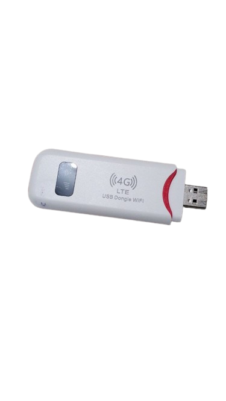

<p align="center"><a href="https://github.com/AlienWolfX/ecoswapX" target="_blank"></a></p>

<p align="center"></a>
</p>

## Achieving SuperSU

To install SuperSU on the USB Dongle, you need to have these files:

- <a href="SR5-SuperSU-v2.82-SR5-20171001224502.zip">SuperSU</a>
- <a href="twrp-3.1.1-0-seed.img">TWRP</a>

After obtaining the necessary files, open a new terminal and execute the following commands:

```
adb push SR5-SuperSU-v2.82-SR5-20171001224502.zip /sdcard

adb reboot bootloader

fastboot boot twrp-3.1.1-0-seed.img
```

The device may take some time to restart adb. Please be patient. Once adb is up and running again, proceed with the following commands:

```
adb shell

twrp install /sdcard/SR5-SuperSU-v2.82-SR5-20171001224502.zip

reboot
```

## Firmware Dump and Restore

Before making any modifications to your device, such as rooting, it's crucial to first back up its firmware. You'll need this <a href="https://github.com/bkerler/edl">tool</a> to execute the commands below.

Note: To enable EDL mode on your device, execute the following command:

```
adb reboot edl
```

Alternatively, for a more hands-on approach, you can short the D+ and GND on the USB before connecting it to your computer. Once the device is in EDL mode, execute the following commands:

```
python3 edl rf {your_filename}.bin
```

To restore simply run

```
python3 edl wf {your_filename}.bin
```

## License

This repository is open-sourced software licensed under the [MIT license](https://opensource.org/licenses/MIT).
