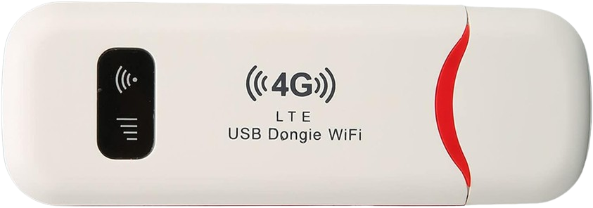

<br /> <p align="center"><a href="https://github.com/AlienWolfX/UZ801-USB_MODEM" target="_blank"></a></p>

<p align="center"></a>
</p>

## Initial

Before doing anything to your USB dongle, you must first enable ADB (if it's not already enabled) by accessing this URL: [http://192.168.100.1/usbdebug.html](http://192.168.100.1/usbdebug.html).

You need to have:

* [edl](https://github.com/bkerler/edl)

If you are using Windows, you must install the following:

* [Universal ADB Driver](https://adb.clockworkmod.com/)
* [QDLoader 9008 Driver](https://qdloader9008.com/)
* [ADB Platform Tools](https://gist.github.com/ifiokjr/b70882d3f1182ed48ec7eefa5c93a740)
* [Zadig](https://zadig.akeo.ie/)

On Windows, you might encounter this error: `NotImplementedError: Operation not supported or unimplemented on this platform`. One way to fix this is by uninstalling the QDLoader 9008 Driver and replacing it with Zadig WinUSB[⁽¹⁾](https://github.com/bkerler/edl/issues/349#issuecomment-2060152724).

## Firmware Dump and Restore

<details>
<summary>Instructions</summary>

To enable EDL mode on your device, execute the following command:

`adb reboot edl`

Alternatively, for a more hands-on approach, you can short the D+ and GND on the USB before connecting it to your computer. Once the device is in EDL mode, execute the following commands to create a backup:

`python3 edl rf {your_filename}.bin`

To restore simply run:

`python3 edl wf {your_filename}.bin`

You can then use tools such as PowerISO to view the different partitions of the image.
</details>

## Achieving SuperSU

<details>
<summary>Instructions</summary>

To install SuperSU on the USB Dongle, you need to have these files:

- <a href="files/SR5-SuperSU-v2.82-SR5-20171001224502.zip">SuperSU</a>
- <a href="files/twrp-3.1.1-0-seed.img">TWRP</a>

After obtaining the necessary files, open a new terminal and execute the following commands:

```
adb push SR5-SuperSU-v2.82-SR5-20171001224502.zip /sdcard

adb reboot bootloader

fastboot boot twrp-3.1.1-0-seed.img
```

The device may take some time to restart adb. Please be patient. Once adb is up and running again, proceed with the following commands:

```
adb shell

twrp install /sdcard/SR5-SuperSU-v2.82-SR5-20171001224502.zip

reboot
```
</details>

## View Device Display
<details>

<summary>Instructions</summary>

As the device is running Android, we can see the display as if it has a screen using a tool named adbcontrol.

- <a href="files/adbcontrol.zip">adbcontrol</a>

Steps

```
extract adbcontrol.zip
cd adbcontrol 
modify config.properties by pointing to the appropriate directories
java -jar adbcontrol.jar
```

Note

```
adbCommand = {LOCATION_OF_ADB_EXE}
localImageFilePath = {LOCATION_ON_YOUR_HOST_MACHINE}
```
</details>

## Installing OpenWrt

<details>
<summary>Instructions</summary>

#### To install openwrt on the device you will need

- <a href="files/openwrt-UZ801_v3.2.tar.gz">OpenWrt UZ801_V3.2</a>

- fsc.bin, fsg.bin modemst1.bin, modemst2.bin from your backup

Steps

```
adb shell reboot edl

python3 edl wf {OPENWRT FILE}

python3 edl reset

adb reboot-bootloader

fastboot oem reboot-edl

python3 edl w fsc fsc.bin
python3 edl w fsg fsg.bin
python3 edl w modemst1 modemst1.bin
python3 edl w modemst2 modemst2.bin

python3 edl reset
```
</details>

## Installing Debian

<details>
<summary>Instructions</summary>

1. Download the file using: `wget https://download.wvthoog.nlopenstick-uz801-v3.0.zip`.
2. Extract the zip file.
3. For Linux, run `./flash.sh`; for Windows, run `./flash.bat`.
4. Wait for the script to execute.
5. Done, All basic functions should now work. Configure the device for your chosen use case.

For more information visit [Wim van 't Hoog](https://wvthoog.nl/openstick/) blog
</details>

## Troubleshooting OpenWrt/Useful Commands and Tools

<details>
<summary>Instructions</summary>

### Connection Refuse 
#### If you encounter this problem simply set this on your OpenWRT dashboard

```
Name
INTERNET

Protocol
Any

Outbound zone
wan modem

Source address
any

Destination address
any

Action
MASQUERADE - Automatically rewrite to outbound interface IP
```

### No internet connection via RNDIS using Wi-Fi
#### Execute:
`nmcli connection modify usb0 ipv4.method shared`

#### After:
```
nmcli connection down usb0
nmcli connection up usb0
```

### Setting Band

`mmcli -m 0 --set-current-bands='{band}'`

### Fetching/Creating Messages
##### <a href="files/msg.py">Here</a> is a simply python script I used to Add, Send, and Recieve messages (Only works with OpenWRT and Debian)
```
python3 msg.py {argument}
```
</details>

## Firmware
Below, I’ve provided a stock dump of my firmware (Philippines version). Please note that flashing this firmware is at your own risk. The board number for this dump is FY_UZ801_V3.2. You might also need to replace the modem firmware for it to work in your region.

- <a href="https://drive.google.com/file/d/18SiujpzU4W2YBRhcZdck5IQEYAyBjcZi/view?usp=sharing">UZ801_V3.2 Stock ROM</a>

#### In case you bricked your device and cannot access EDL just short the pins below

<p align="center"><a href="img/Uz801_board.jpg" target="_blank"></a></p>

## References

This project references the following resources:

- [Wim van 't Hoog](https://wvthoog.nl/openstick/) - For Debian Kernel build and instructions.
- [ddscentral](https://github.com/ddscentral) - For Debian build and instructions.
- [postmarketOS](https://wiki.postmarketos.org/wiki/Zhihe_series_LTE_dongles_(generic-zhihe)) - Instructions and Board pinout image
- [edl](https://github.com/bkerler/edl) - Primary tool for dumping the Original firmware

These resources have been instrumental in the creation of this project.

## License

This repository is open-sourced software licensed under the [MIT license](https://opensource.org/licenses/MIT).

<p align="center">Copyright <b>AlienWolfX</b> 2024</p>