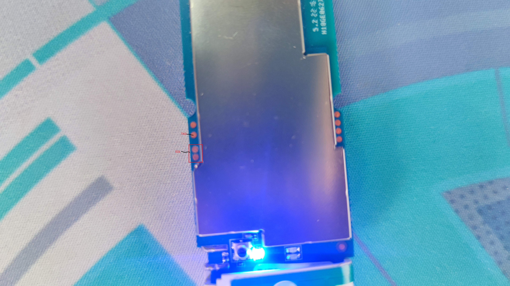

# UZ801 Analysis

[](LICENSE)
 
<details>

<summary>Table of Contents</summary>

- [Introduction](#introduction)
- [Initial](#initial)
- [Firmware Dump and Restore](#firmware-dump-and-restore)
- [Getting Root](#getting-root)
- [View Device Display](#view-device-display)
- [Modifying Web UI](#modifying-web-ui)
- [Installing OpenWrt](#installing-openwrt)
- [Installing Debian (6.7)](#installing-debian-based-on-67-msm8916-mainline)
- [Installing Debian (5.15)](#installing-debian-based-on-515-msm8916-mainline)
- [Troubleshooting](rsc/troubleshooting.md)
- [Recovery](#recovery)
- [References](#references)
- [License](#license)

</details>

## Introduction

A couple of months ago, I purchased this 4G LTE USB Dongle from Shopee for around 300+ PHP. Out of curiosity, I searched the internet to see if there was a way to modify the horrible web UI of the device. Here are some images of the device along with the board and it's chips.

|     |        |
| ---------------------------------- | ---------------------------------- |
|  |  |
|       |     |
|    |    |
|      |                                    |

The device heart of the dongle is a MSM8916 which is running a stripped-down version of Android 4.4.4 KitKat, the android setup restricts the use of the additional two CPU cores. I believe this is to prevent the device from overheating.

The web UI is so poorly designed that simply changing the URL and calling `main.html` will take you to the main page:


## Initial

> [!WARNING]
> I just want to clarify that I'm not responsible if something goes wrong and the device gets bricked. Please proceed at your own risk and make sure to back up your data before attempting any modifications

> [!IMPORTANT]  
> Before doing anything to your USB dongle, you must first enable ADB (if it's not already enabled) by accessing this URL: [http://192.168.100.1/usbdebug.html](http://192.168.100.1/usbdebug.html).

You need to have:

- [edl](https://github.com/bkerler/edl)

If you are using Windows, you must install the following:

- [Universal ADB Driver](https://adb.clockworkmod.com/)
- [QDLoader 9008 Driver](https://qdloader9008.com/)
- [ADB Platform Tools](https://gist.github.com/ifiokjr/b70882d3f1182ed48ec7eefa5c93a740)
- [Zadig](https://zadig.akeo.ie/)

On Windows, If you intend to use edl you might encounter this error: `NotImplementedError: Operation not supported or unimplemented on this platform`. One way to fix this is by uninstalling the QDLoader 9008 Driver and replacing it with Zadig WinUSB[⁽¹⁾](https://github.com/bkerler/edl/issues/349#issuecomment-2060152724).

## Firmware Dump and Restore

To enable EDL mode on your device, execute the following command:

`adb reboot edl`

Alternatively, for a more hands-on approach, you can short the D+ and GND on the USB or the 2 pads on the board before connecting it to your computer. Once the device is in EDL mode, execute the following commands to create a full backup:

`python3 edl rf {your_filename}.bin`

To restore simply run:

`python3 edl wf {your_filename}.bin`

for individual backup:

`python3 edl rl {your_foldername} --genxml`

You can then use tools such as PowerISO to view the different partitions of the dump.

## Getting Root

> [!IMPORTANT]  
> Some devices have root access out of the box. Before proceeding, kindly check if yours does.

To gain root access, you need to install SuperSU on the USB dongle. Ensure you have the following files:

- [SuperSU](https://github.com/AlienWolfX/UZ801-USB_MODEM/releases/download/rev1/SR5-SuperSU-v2.82-SR5-20171001224502.zip)
- [TWRP](https://github.com/AlienWolfX/UZ801-USB_MODEM/releases/download/rev1/twrp-3.1.1-0-seed.img)

After obtaining the necessary files, open a new terminal and execute the following commands:

```bash
adb push SR5-SuperSU-v2.82-SR5-20171001224502.zip /sdcard

adb reboot bootloader

fastboot boot twrp-3.1.1-0-seed.img
```

The device may take some time to restart adb. Please be patient. Once adb is up and running again, proceed with the following commands:

```bash
adb shell

twrp install /sdcard/SR5-SuperSU-v2.82-SR5-20171001224502.zip

reboot
```

## View Device Display

We can use adbcontrol to see what's going on with the device.

- [adbcontrol](https://github.com/AlienWolfX/UZ801-USB_MODEM/releases/download/rev1/adbcontrol.zip)

> [!TIP]
> You need to modify the config.properties file accordingly  
> `adbCommand = {LOCATION_OF_ADB_EXE}`
> `localImageFilePath = {LOCATION_ON_YOUR_HOST_MACHINE}`

By default a screen timeout which results to a black screen when no activity is present, to bypass this we need to run:

```bash 
adb shell settings put system screen_off_timeout 2147483647

adb shell input keyevent 26
```

Steps:

```bash
extract adbcontrol.zip

cd adbcontrol

java -jar adbcontrol.jar
```

## Modifying Web UI

First and foremost we need to identify the correct apk file some version of this dongle comes with the Jetty2m.apk and MifiService.apk in my case the MifiService.apk was located in `/system/priv-app/MifiService.apk` I then pulled the apk using `adb pull /system/priv-app/MifiService.apk`

Fetch test-keys:

```bash
git clone https://android.googlesource.com/platform/build
cd build/target/product/security/
openssl pkcs8 -inform DER -nocrypt -in platform.pk8 -out platform.pem
openssl pkcs12 -export -in platform.x509.pem -inkey platform.pem -out platform.p12 -password pass:android -name testkey
keytool -importkeystore -deststorepass android -destkeystore platform.keystore -srckeystore platform.p12 -srcstoretype PKCS12 -srcstorepass android
mv platform.keystore {YOUR_WORK_DIR}
```

Decompile apk:

`java -jar apktool.jar d {APP_NAME}.apk -o {APP_NAME}`

You can then start to customization under the assets folder

> [!TIP]  
> Don't forget to change the `versionCode` and `versionName` in the apktool.yml

Recompile apk(If asked for a passphrase type `android`):

`java -jar apktool.jar b -o unsigned.apk {APP_NAME}`

Zipalign:

```bash
zipalign -v 4 unsigned.apk aligned.apk
jarsigner -verbose -sigalg SHA1withRSA -digestalg SHA1 -keystore ./platform.keystore  aligned.apk testkey
```

Install apk:

`adb install -r aligned.apk`

## Installing OpenWrt

> [!IMPORTANT]
> Current OpenWRT firmware use the mcfg_sw.mbn located under ***MODEM_PR\MCFG\CONFIGS\MCFG_SW\GENERIC\COMMON\DEFAULT\DEFAULT***. I haven't tested it if it works
> across different regions, If you can't get signal with yours kindly refer to  [Changing Region](rsc/troubleshooting.md#changing-modem-region)

1. Download `openwrt-UZ801.tar.xz` from releases
2. Extract the compressed file with `tar xf openwrt-UZ801.tar.xz`.
3. cd OpenWRT-UZ801.
4. For Linux, run `./flash.sh`; for Windows, run `./flash.bat`.
5. If all goes well you can now see a constant blinking red and blue light.

## Installing Debian (Based on 6.7 msm8916 mainline)

1. Download the file using: `wget https://download.wvthoog.nl/openstick-uz801-v3.0.zip`.
2. Extract the zip file.
3. Execute `adb reboot-bootloader`
4. For Linux, run `./flash.sh`; for Windows, run `./flash.bat`.
5. Wait for the script to execute.
6. If all goes well All basic functions should now work. Configure the device for your chosen use case.

For more information visit [Wim van 't Hoog](https://wvthoog.nl/openstick/) blog

## Installing Debian (Based on 5.15 msm8916 mainline)

> [!NOTE]
> To be updated

## Recovery

In case you bricked your device and cannot access EDL, just short the pins below and follow the [restore guide](#firmware-dump-and-restore).



## References

This project references the following resources:

- [Wim van 't Hoog](https://wvthoog.nl/openstick/) - For Debian build and instructions.

- [ddscentral](https://github.com/ddscentral) - For Debian build and instructions.

- [postmarketOS](<https://wiki.postmarketos.org/wiki/Zhihe_series_LTE_dongles_(generic-zhihe)>) - Instructions and Board pinout image

- [edl](https://github.com/bkerler/edl) - Primary tool for dumping the Original firmware

- [adrian-bl](https://github.com/adrian-bl) - Instruction for modifying Web UI

- [HandsomeYingyan](https://github.com/HandsomeYingyan) - For HandsomeMod source code

These resources have been instrumental in the creation of this project.

## License

This repository is open-sourced software licensed under the [MIT license](https://opensource.org/licenses/MIT).

<p align="center">Copyright <b>AlienWolfX</b> 2024</p>
